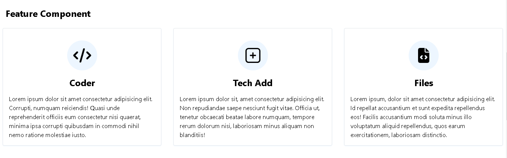
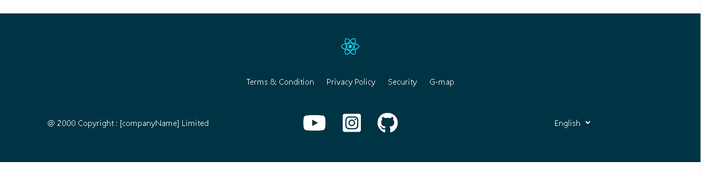
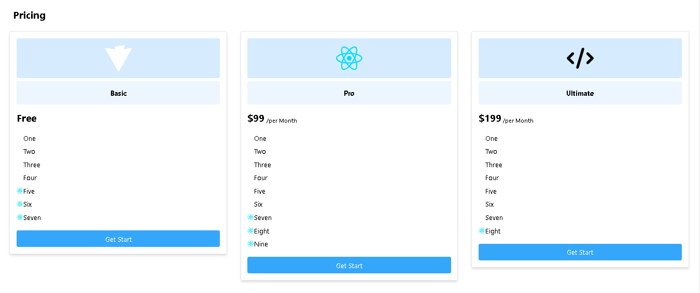
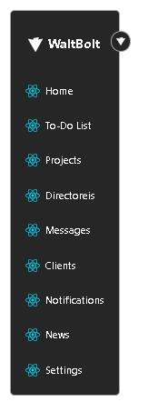
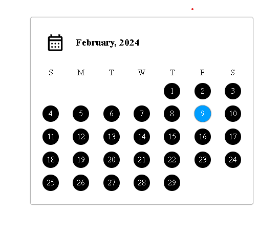
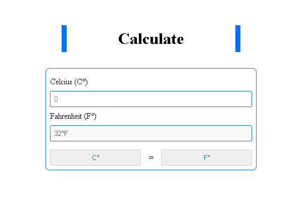
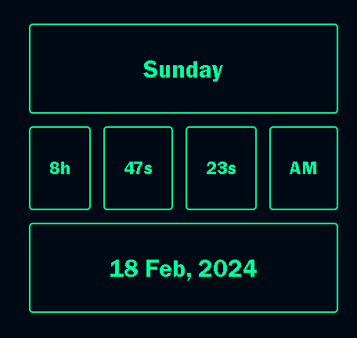
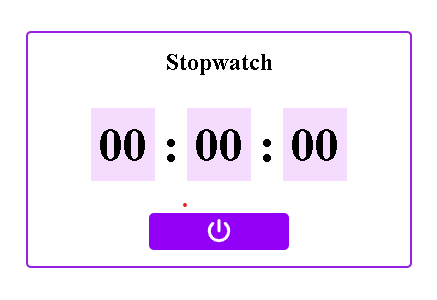

<H1 style="text-center"> Sunday-Challenge-2024 </H1>

<h3> (1) 07th Jan, 2024 - Feature component </h3>

<h3> (2) 14th Jan, 2024 - Footer component </h3>

<h3> (3) 21th Jan, 2024 - Pricing component </h3>

<h3> (4) 28th Jan, 2024 - Sidebar component </h3>

<h3> (5) 04th Feb, 2024 - Calander (HTML, CSS, Javascript) </h3>

<h3> (6) 11th Feb, 2024 - Unit converter - C° to F° (HTML, CSS, Javascript) </h3>

<h3> (7) 18th Feb, 2024 - Clock (HTML, CSS, Javascript) </h3>

<h3> (8) 25th Feb, 2024 - Stopwatch (HTML, CSS, Javascript)</h3>

<h3> (9) 03th March, 2024 - Background changer (react.js)</h3>
